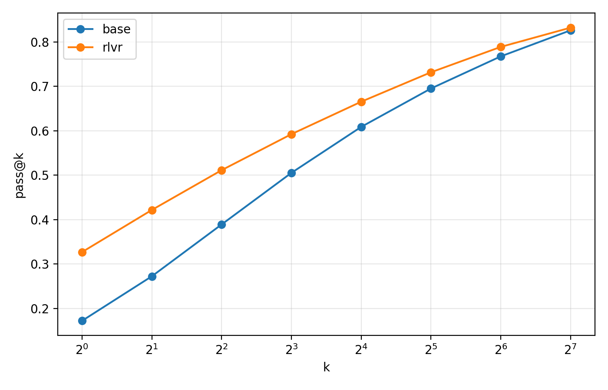
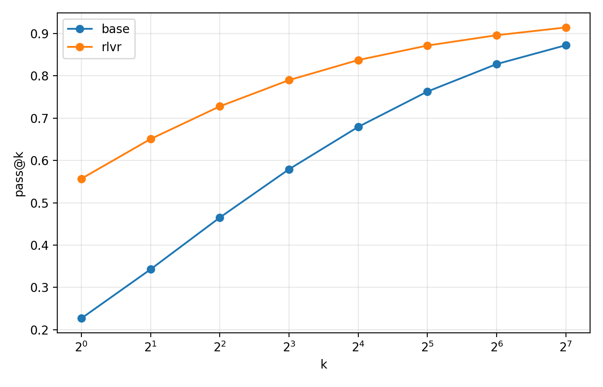
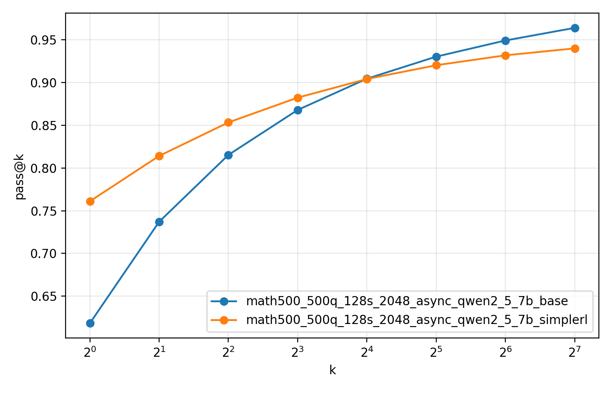

# MATH-500 pass@k Reproduction

This repository reproduces MATH-500 pass@k evaluations for Qwen2.5 base models
and SimpleRL/RLVR-tuned models at 0.5B, 1.5B, and 7B scale.

## Charts

<table>
  <tr>
    <th>0.5B</th>
    <th>1.5B</th>
    <th>7B</th>
  </tr>
  <tr>
    <td></td>
    <td></td>
    <td></td>
  </tr>
</table>

## Conclusions

RL improves pass@1 across all three model sizes. This indicates that zero-RL,
that is, applying RL directly without supervised fine-tuning, improves the
single-sample reasoning performance of base models.

Following Yue (2025), larger-k pass@k can be interpreted as a proxy for broader
reasoning capability under repeated sampling. Across all experiments, the gap
between the base and RL models decreases as k increases. For the 7B model, the
base model surpasses the RL model at high k, especially when k >= 32. This
suggests that RL improves reasoning performance, but does not necessarily expand
the model's reasoning capability boundary. The lower high-k pass@k of the RL
model may also indicate reduced coverage of diverse solution paths under
sampling.

## Experiment Setup

All reported experiments use 500 MATH-500 problems with 128 sampled completions
per problem, for 64,000 generations per model.

| Setting | Value |
| --- | --- |
| Backend | `vllm_async` |
| Dataset | MATH-500 |
| Problems | 500 |
| Samples per problem | 128 |
| Max new tokens | 2048 |
| Max model length | 4096 |
| Temperature | 0.6 |
| Top-p | 0.95 |
| pass@k | `1,2,4,8,16,32,64,128` |

Prompt files differ by run:

| Model size | Prompt file |
| --- | --- |
| 0.5B | `data/processed/math500_simplerl.jsonl` |
| 1.5B | `data/processed/math500_simple_prompt.jsonl` |
| 7B | `data/processed/math500_simplerl.jsonl` |

For the 1.5B model, the SimpleRL chat-style prompt degraded performance in our
experiments. Following the SimpleRL-Zoo paper, we therefore adopted the simple
prompt for the 1.5B runs.

## Detailed Results

| Model | pass@1 | pass@2 | pass@4 | pass@8 | pass@16 | pass@32 | pass@64 | pass@128 |
| --- | ---: | ---: | ---: | ---: | ---: | ---: | ---: | ---: |
| Qwen2.5-0.5B base | 0.1720 | 0.2722 | 0.3889 | 0.5051 | 0.6085 | 0.6950 | 0.7673 | 0.8260 |
| Qwen2.5-0.5B SimpleRL | 0.3267 | 0.4215 | 0.5111 | 0.5922 | 0.6653 | 0.7315 | 0.7887 | 0.8320 |
| Qwen2.5-1.5B base | 0.2269 | 0.3427 | 0.4650 | 0.5791 | 0.6792 | 0.7626 | 0.8275 | 0.8720 |
| Qwen2.5-1.5B SimpleRL | 0.5567 | 0.6505 | 0.7276 | 0.7896 | 0.8370 | 0.8712 | 0.8957 | 0.9140 |
| Qwen2.5-7B base | 0.6183 | 0.7371 | 0.8153 | 0.8679 | 0.9045 | 0.9303 | 0.9492 | 0.9640 |
| Qwen2.5-7B SimpleRL | 0.7610 | 0.8141 | 0.8534 | 0.8823 | 0.9042 | 0.9203 | 0.9319 | 0.9400 |
